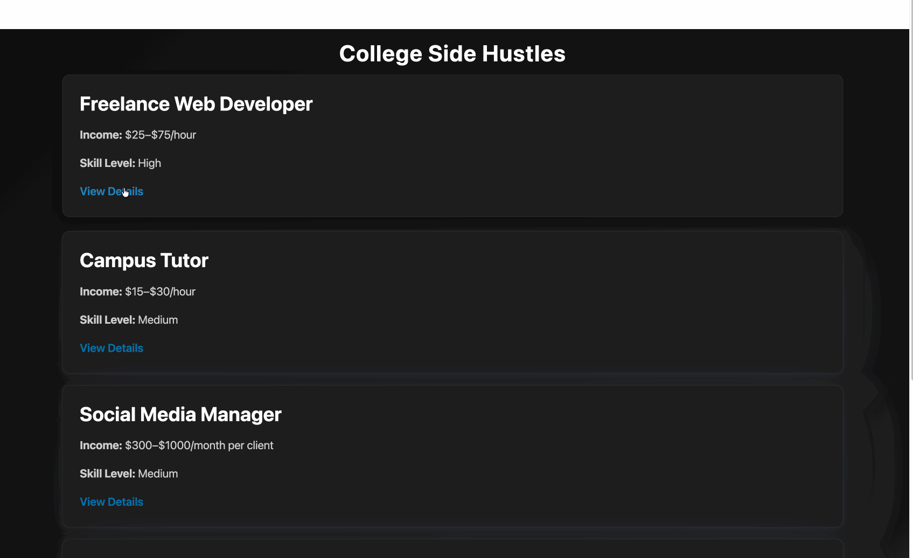

# WEB103 Project 1 - Listicle

Submitted by: **Kaleab Alemu**

About this web app: **A WebApp that contains a list of side hustles college students may be engaged in**

Time spent: 4 hours

## Required Features

The following **required** functionality is completed:

<!-- Make sure to check off completed functionality below -->
- [X] **The web app uses only HTML, CSS, and JavaScript without a frontend framework**
- [X] **The web app displays a title**
- [X] **The web app displays at least five unique list items, each with at least three displayed attributes (such as title, text, and image)**
- [X] **The user can click on each item in the list to see a detailed view of it, including all database fields**
- [X] **Each detail view should be a unique endpoint, such as as `localhost:3000/bosses/crystalguardian` and `localhost:3000/mantislords`**
- [X] *Note: When showing this feature in the video walkthrough, please show the unique URL for each detailed view. We will not be able to give points if we cannot see the implementation* 
- [X] **The web app serves an appropriate 404 page when no matching route is defined**
- [X] **The web app is styled using Picocss**

## Video Walkthrough
Here's a walkthrough of implemented required features:

GIF created with ...  LICEcap
